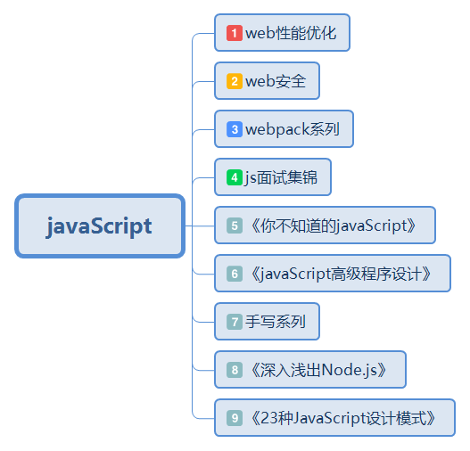

## 我要做什么呢？🐂
我一直想写一个js知识库，对它语言本身的特点深入剖析，方便在工作，面试中解决问题，让我们认清它的全貌。同时我也会做一些简单知识的积累。
## 我为什么要这样做呢？🐂
- 直接原因：面试可能要问，网上有很多面试题，作为前端开发，js是必须问的，🤔第一道数据的基本类型。。。。，也许大家都很熟悉，那么js的其他特点呢，我一开始知识记忆，但心里有点发虚，总觉得自己少点什么，可能是因为我和它不熟。让我想一探究竟的是因为看《你不知道的javaScript》上卷讲词法作用域那一章，“静态词法作用域”，即在写好代码还没运行前，它的作用域已经确定了。这很基础，但之前没有意识到。这让我反省了一下。。。
- 根本原因：我想提高技术能力和水准
## 我要怎么做呢？🐂
- 一般我会使用xmind进行梳理，如果你有xmind,可以下载xmind文件直接查看，当然我也把它转成了pdf，你可以直接看pdf文件夹。
- 通过阅读js书籍，（小黄书，红宝书），看一些js大牛的博客，网上的博文，以及线下交流，项目开发遇到的问题不断去深入。
## 日期进度追踪
|  日期   | 今日内容  |
|  ----  | ----  |
|  2021.03.22   | 词法阶段 欺骗词法的手段 简单工程模式的笔记   |
## 大纲

## 当前更新进度🐂
|  技术点   | 主要内容  |
|  ----  | ----  |
|web性能优化| [雅虎军规主要从七个方面：页面内容 css javaScript 服务器 cookies 移动端 图片](./xmind/雅虎军规.xmind)|
| web安全  |[五种安全服务，八种安全机制，常见web安全 xss csrf,sql注入,os注入,DDos](./xmind/we.xmind) |
|浏览器的几个特点|[图解浏览器](./xmind/brower.md)|
|webpack系列|[webpack系列](https://github.com/XINXINP/CI-CD/tree/master/webpack%E7%B3%BB%E5%88%97%E5%AD%A6%E4%B9%A0%EF%BC%881%EF%BC%89)|
|js面试集锦|[面试常考知识点](./js/README.md)|
|《你不知道的javaScript》|[几个重要的特性的深度理解](./jsknow/README.md)|
|《javaScript高级程序设计》|[js各个部分理解](./gcjs/README.md)|
|手写系列|[js手写简易的特性](./handWrite/README.md)|
|《深入浅出Node.js》|[了解node.js特性](./node/README.md)|
|《23种JavaScript设计模式》|[设计模式](./jsmode/README.md)|
|newMVVM|[newMVVM](./xmind/newMVVM.xmind)|
|深入理解http工作原理|[深入理解http工作原理](./xmind/http.xmind)|
|Node学习|[Node学习](./xmind/Node.xmind)|
|前端知识点标签|[知识点标签](./xmind/tab.xmind)|
## 最后🐂
大家有什么问题，可以在issue中提交，我看到后会及时回复的。祝愿大家在2021年身体健健康康，技术水平越来越高！
- [博客地址📌](http://blog.pxbtf.com)