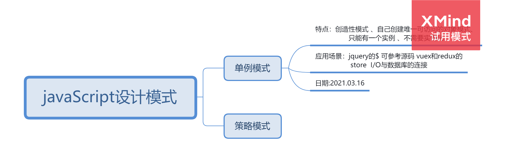

<!--
 * @Author: your name
 * @Date: 2021-03-16 09:24:05
 * @LastEditTime: 2021-03-22 10:32:16
 * @LastEditors: Please set LastEditors
 * @Description: In User Settings Edit
 * @FilePath: \jsSkill\jsmode\README.md
-->
## javaScript设计模式
### 什么是设计模式？
- 关键词：<font color='red'> 解决问题的方案 </font>
- 针对某一个共性问题，有一套成熟的解决方案
### 设计模式分类
- 创建型模式 🐣：可以决定生成哪些对象，提高了程序的灵活性
- 结构型模式 📠：向现有对象添加功能的不同方式
- 行为型模式 👍：描述对象之间如何相互作用
### 有什么用呢？
- 看源码，有时侯看框架源码的时候，会发现其中运用了设计模式，比如发布订阅模式，路由的策略模式，工厂模式，原型模式等等
- 待补充 。。。
### 设计模式之旅

#### singleton（单例模式）
- ✅ 单、 创建对象的最佳方式
- 特点：提供了一种访问其唯一的对象的方式，可以直接访问，不需要实例化该类的对象。
- 👀：该类只有一个实例 、要自己创建自己的唯一的实例、同时要给所有其他对象提供这一实例
- 所用的地方：
- jQuery 的$ 可以查看一下源码
- 登录框、购物车
- Vuex和Redux中的store
````javaScript
class Single {
    log() {
        console.log('Single...')
    };
    static getInstance() {
        let instance; //闭包
        return function() {
            if (!instance) {
                instance = new Single();
            }
            return instance;//自己创建自己的实例
        }
    };
}
Single.getInstance()() //不需要实例化该类的对象
````
#### 工厂模式
- 什么是工厂模式？（what）
利用工厂方法替代new操作的一种模式。主要包含工厂方法和抽象工程模式（创建型）。
- 工厂模式的历史？（when）
俗称实例化对象模式，Jive论坛采用了这个设计模式
- 如何使用工厂模式？（how）
- 工厂模式与工厂的函数有哪些区别？
- 这个设计模式的具体应用在那些场景中？
- 简单工厂模式的实质?
基类根据传入的参数，返回一个new的子类的实例（根据参数判断new哪个子类）
````javaScript
//子类1
function apple() {  
    console.log("apple");
}
//子类2
function orange() {  
    console.log("orange");
}
//基类
function Factory(params) {
    switch(params){
        case "a": return new apple()//返回new子类的实例
        case "b": return new apple()
    }
}
Factory(a)//像基类传入参数
````
- 这样做的好处有哪些？
可以把一些方法封装到一个类里，减少全局变量的方法，减少命名的冲突